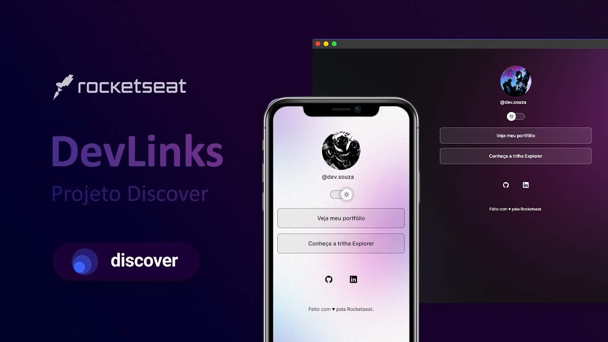

<h1 align="center">Readme Models</h1>

  <a href="#-hospedagem">Hospedagem</a>&nbsp;&nbsp;&nbsp;|&nbsp;&nbsp;&nbsp;
  <a href="#-tecnologias">Tecnologias</a>&nbsp;&nbsp;&nbsp;|&nbsp;&nbsp;&nbsp;
  <a href="#-projeto">Projeto</a>&nbsp;&nbsp;&nbsp;|&nbsp;&nbsp;&nbsp;
  <a href="#-layout">Layout</a>&nbsp;&nbsp;&nbsp;|&nbsp;&nbsp;&nbsp;
  <a href="#-licença">Licença</a>&nbsp;&nbsp;&nbsp;

 

## ☆ Hospedagem
Lorem ipsum dolor sit amet, consectetur adipiscing elit, sed do eiusmod tempor incididunt ut labore et dolore magna aliqua.  
https://https-shini.github.io/portfolio/#home

## ☆ Tecnologias
Lorem ipsum dolor sit amet, consectetur adipiscing elit.
* Sit amet consectetur adipiscing elit duis tristique sollicitudin nibh.
* Nibh sit amet commodo nulla facilisi nullam vehicula.
* Nisl nunc mi ipsum faucibus vitae aliquet.

## ☆ Projeto
➜ [Como contribuir?](./read-model/CONTRIBUTING.md)  
➜ [Como o projeto está estruturado?](./read-model/STRUCTURE.md)  
➜ [Documentação aprodofundada](./read-model/MODEL.md) 

Lorem ipsum dolor sit amet, consectetur adipiscing elit, sed do eiusmod tempor incididunt ut labore et dolore magna aliqua. Sit amet consectetur adipiscing elit duis tristique sollicitudin nibh. Nibh sit amet commodo nulla facilisi nullam vehicula. Sit amet luctus venenatis lectus magna. Egestas diam in arcu cursus euismod quis viverra. Porttitor lacus luctus accumsan tortor posuere ac.

## ☆ Layout
Lorem ipsum dolor sit amet, consectetur adipiscing elit, sed do eiusmod tempor incididunt ut labore et dolore magna aliqua.

> [!NOTE]
> Useful information that users should know, even when skimming content.

## ☆ Licença
Esse projeto está sob a [licença MIT](/LICENSE).
