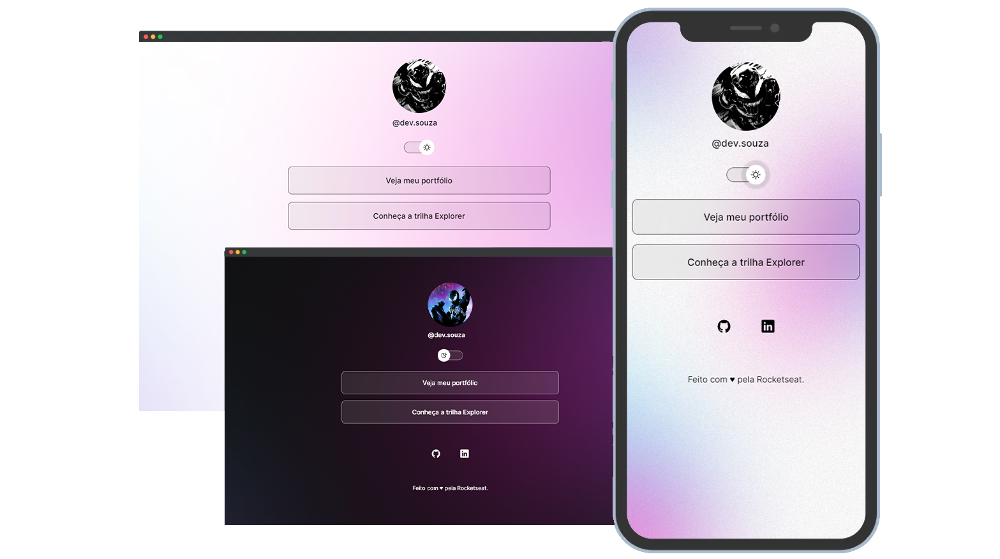

<h1 align="center">Chat Web</h1>

  <a href="#-hospedagem">Hospedagem</a>&nbsp;&nbsp;&nbsp;|&nbsp;&nbsp;&nbsp;
  <a href="#-tecnologias">Tecnologias</a>&nbsp;&nbsp;&nbsp;|&nbsp;&nbsp;&nbsp;
  <a href="#-projeto">Projeto</a>&nbsp;&nbsp;&nbsp;|&nbsp;&nbsp;&nbsp;
  <a href="#-layout">Layout</a>&nbsp;&nbsp;&nbsp;|&nbsp;&nbsp;&nbsp;
  <a href="#-licença">Licença</a>&nbsp;&nbsp;&nbsp;

 

## ☆ Hospedagem
- Acesse o link abaixo e veja o código hospedado online. 
https://chat-frontend-g42t.onrender.com

## ☆ Tecnologias
- Frontend:
  - HTML5
  - CSS3
  - JavaScript
    
- Backend:
  - Node.js
  - WebSocket (ws)
  - dotenv (para configuração de variáveis de ambiente)

## ☆ Projeto
➜ [Como contribuir?](./read-model/CONTRIBUTING.md)  
➜ [Documentação aprofundada](./read-model/MODEL.md) 

 

Este projeto é uma aplicação desenvolvida para permitir a comunicação em tempo real entre usuários através da internet. Esta aplicação oferece uma plataforma intuitiva e acessível para que os usuários possam trocar mensagens de forma rápida e conveniente, sem a necessidade de instalação de softwares adicionais. O Chat Web utiliza tecnologias modernas, como HTML5, CSS3 e JavaScript no frontend, e Node.js no backend, juntamente com o protocolo WebSocket para fornecer uma experiência de chat em tempo real, possibilitando conversas fluidas e interativas entre os usuários.

**Estrutura do Projeto:**
- **Frontend:** Define a estrutura da página web, formulários de login e envio de mensagens, e área de exibição das mensagens.
- **Backend:** Gerencia a comunicação entre os clientes, recebendo e enviando mensagens em tempo real.

**Funcionalidades Principais:**
- **Login de Usuário:** Os usuários podem inserir seus nomes para acessar o chat.
- **Troca de Mensagens em Tempo Real:** Os usuários podem enviar e receber mensagens em tempo real, com atualizações dinâmicas na interface.
- **Estilização Dinâmica das Mensagens:** As mensagens podem ser visualmente diferenciadas entre mensagens próprias e de outros usuários.
- **Responsividade:** A aplicação é responsiva, adaptando-se a diferentes dispositivos e tamanhos de tela.

**Uso do Projeto:**
- Os usuários acessam a aplicação através de um navegador web.
- Eles inserem seus nomes no formulário de login e entram no chat.
- Podem então digitar mensagens no formulário de envio e enviá-las para serem exibidas na área de mensagens.

## ☆ Layout
Obtenha uma perspectiva detalhada do layout do projeto por meio da imagem abaixo.

## ☆ Licença
Esse projeto está sob a [licença MIT](/LICENSE).
