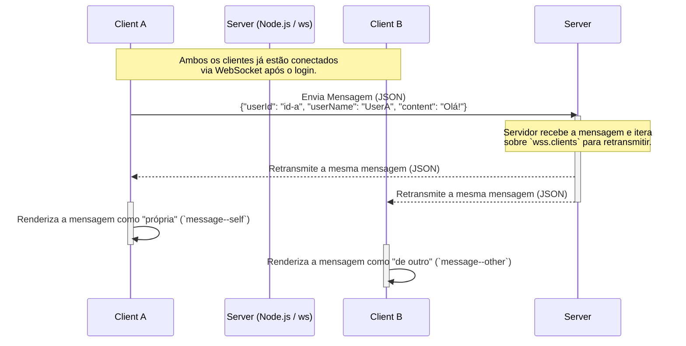

# Documentação Técnica e Guia de Evolução

## Introdução

Este documento serve como uma documentação técnica completa do projeto "Chat Web" em seu estado atual e como um guia de implementação detalhado para futuras funcionalidades. O objetivo é fornecer um entendimento profundo da arquitetura existente e um roteiro claro para transformar a aplicação em uma plataforma de chat mais robusta, segura e rica em funcionalidades, inspirada em serviços como Discord, Telegram e WhatsApp.

---

## **Parte 1: Documentação Detalhada do Projeto Atual**

### **1.1. Visão Geral e Arquitetura**

O projeto é uma aplicação de chat em tempo real construída sobre uma **arquitetura cliente-servidor**. O núcleo da sua funcionalidade reside no uso do protocolo **WebSocket**, que estabelece um canal de comunicação bidirecional e persistente entre o cliente (navegador do usuário) e o servidor (Node.js). Isso permite que as mensagens sejam entregues instantaneamente sem a necessidade de o cliente fazer requisições repetidas (polling).

-   **Cliente (Frontend)**: Uma Single-Page Application (SPA) responsável pela renderização da interface, captura de inputs do usuário e gerenciamento da conexão WebSocket do lado do cliente.
-   **Servidor (Backend)**: Um servidor Node.js que opera como um hub central. Ele gerencia as conexões WebSocket de todos os clientes e atua como um "broadcast server", retransmitindo as mensagens recebidas para todos os participantes conectados.

### **1.2. Análise dos Componentes**

#### **Frontend**

O frontend é a face da aplicação, construído com tecnologias web padrão para garantir máxima compatibilidade.

* **`frontend/index.html` - Estrutura da Interface**
    * Define a estrutura semântica da página, contendo duas seções principais: `<section class="login">` e `<section class="chat">`.
    * A seção de login contém um formulário (`<form class="login__form">`) com um campo de texto (`<input class="login__input">`) para o nome do usuário e um botão de submissão.
    * A seção de chat, inicialmente oculta (`display: none`), contém a área de exibição de mensagens (`<section class="chat__messages">`) e o formulário para envio de novas mensagens (`<form class="chat__form">`).
    * Utiliza o Google Fonts para a fonte "Inter" e o Material Symbols para ícones, como o de envio.

* **`frontend/css/style.css` - Estilização e Design**
    * Adota um design responsivo (`width: 100%`, `height: 100dvh`) para se adaptar a diferentes tamanhos de tela.
    * O tema é escuro, com um fundo texturizado (`background: url("../images/background.png")`).
    * A principal diferenciação visual está nas classes `.message--self` e `.message--other`. Mensagens próprias (`self`) têm um fundo claro, alinhamento à direita (`align-self: flex-end`) e bordas arredondadas específicas (`border-radius: 10px 10px 0 10px`) para imitar a aparência de apps de chat modernos. Mensagens de outros (`other`) têm fundo escuro, alinhamento à esquerda e bordas diferentes.

* **`frontend/js/script.js` - Lógica do Cliente**
    * **Inicialização**: Seleciona todos os elementos DOM necessários para login e chat.
    * **Objeto `user`**: Mantém o estado do usuário localmente (`{ id: "", name: "", color: "" }`). O `id` é gerado via `crypto.randomUUID()` para garantir um identificador único por sessão. A cor é selecionada aleatoriamente de uma lista pré-definida, o que ajuda a diferenciar visualmente os usuários.
    * **`handleLogin(event)`**: Previne o comportamento padrão do formulário, atribui os dados ao objeto `user`, alterna a visibilidade das seções de login e chat, e, crucialmente, instancia a conexão `new WebSocket(...)` com o servidor.
    * **`sendMessage(event)`**: Captura o texto do `chatInput`, cria um objeto de mensagem com os dados do usuário e o envia ao servidor em formato JSON (`websocket.send(JSON.stringify(message))`).
    * **`processMessage({ data })`**: É o listener `onmessage` do WebSocket. Ele recebe a string JSON do servidor, a converte em objeto (`JSON.parse(data)`), e decide qual função de renderização chamar (`createMessageSelfElement` ou `createMessageOtherElement`) com base na correspondência do `userId`. Após adicionar a nova mensagem ao DOM, chama `scrollScreen()` para manter a visão na mensagem mais recente.

#### **Backend**

O backend é simples e direto, focado em sua única responsabilidade: retransmitir mensagens.

* **`backend/src/server.js` - Lógica do Servidor**
    * **Dependências**: Importa o `WebSocketServer` da biblioteca `ws` e o `dotenv` para configuração.
    * **Inicialização do Servidor**: Cria uma nova instância de `WebSocketServer` na porta definida pela variável de ambiente `PORT` ou, como fallback, na porta `8080`.
    * **Gerenciamento de Conexão (`wss.on("connection", ws => { ... })`)**: Este é o principal bloco de código. Ele é executado para cada novo cliente que se conecta.
    * **Lógica de Broadcast**: Dentro do callback de conexão, o listener `ws.on("message", data => { ... })` é definido. Ao receber uma mensagem (`data`), ele itera sobre todos os clientes conectados (`wss.clients.forEach(...)`) e envia a mesma mensagem para cada um deles (`client.send(data.toString())`). Esta é a implementação do padrão de "broadcast".

### **1.3. Fluxo de Dados e Ciclo de Vida da Mensagem**

1.  **Origem (Cliente A)**: O usuário A digita "Olá!" e pressiona Enter.
2.  **Captura (Cliente A)**: O evento `submit` do formulário de chat é acionado. A função `sendMessage` no `script.js` é executada.
3.  **Formatação (Cliente A)**: A função cria um objeto JSON:
    ```json
    {
      "userId": "uuid-do-usuario-a",
      "userName": "NomeDoUsuarioA",
      "userColor": "hotpink",
      "content": "Olá!"
    }
    ```
4.  **Transmissão (Cliente A -> Servidor)**: Este objeto é convertido para uma string JSON e enviado ao servidor via `websocket.send()`.
5.  **Recepção (Servidor)**: O `WebSocketServer` no `server.js` recebe a string. O evento `ws.on("message")` é acionado.
6.  **Broadcast (Servidor -> Todos os Clientes)**: O servidor não inspeciona o conteúdo. Ele simplesmente pega a `data` recebida e a retransmite para todos os clientes conectados, incluindo o Cliente A.
7.  **Recepção (Todos os Clientes)**: O `websocket.onmessage` é acionado no `script.js` de todos os usuários conectados.
8.  **Renderização (Todos os Clientes)**: A função `processMessage` analisa o JSON.
    * No Cliente A, `userId` corresponde, então `createMessageSelfElement` é chamada.
    * Nos Clientes B, C, D, `userId` não corresponde, então `createMessageOtherElement` é chamada, usando `userName` e `userColor` para estilizar a mensagem.
    * A nova "bolha" de mensagem é adicionada ao `chat__messages`, e a tela rola para a nova mensagem.

#### Diagrama 1: Arquitetura Atual (Broadcast Simples)



---

## **Parte 2: Guia de Implementação Detalhado para Novas Funcionalidades**

### **Categoria 1: Funcionalidades Essenciais para a Experiência do Usuário**

#### 1. Lista de Usuários Online
* **Backend**:
    1.  No `server.js`, inicialize `const clients = new Map();`.
    2.  Modifique o `wss.on('connection')`: gere um ID único para a conexão (`const clientId = crypto.randomUUID();`).
    3.  No primeiro evento `message`, que agora deve ser um evento de "login", armazene os dados do usuário: `clients.set(ws, { id: clientId, name: userName });`.
    4.  Crie a função `broadcastUserList()`: `const userList = Array.from(clients.values()); wss.clients.forEach(c => c.send(JSON.stringify({ type: 'user_list', payload: userList })));`.
    5.  Chame `broadcastUserList()` após um novo usuário se registrar e dentro do `ws.on('close')`.
    6.  No `ws.on('close')`, remova o cliente do `Map`: `clients.delete(ws);`.
* **Frontend**:
    1.  Adicione `<div class="user-list"></div>` ao `index.html`.
    2.  No `script.js`, dentro do `onmessage`, adicione um `case 'user_list'`:
        ```javascript
        case 'user_list':
          const userListElement = document.querySelector('.user-list');
          userListElement.innerHTML = ''; // Limpa a lista
          payload.forEach(user => {
            const userElement = document.createElement('p');
            userElement.textContent = user.name;
            userListElement.appendChild(userElement);
          });
          break;
        ```
* **Exemplo de Mensagem**: `{ "type": "user_list", "payload": [{ "id": "...", "name": "..." }] }`

#### 2. Indicador de "Digitando..."
* **Backend**:
    1.  Crie um novo tipo de evento `"typing"`.
    2.  Ao receber `{ "type": "typing", "payload": { "isTyping": true } }`, retransmita-o para todos os outros clientes com o nome do usuário.
    3.  Para parar a notificação, o cliente pode enviar `isTyping: false`, ou o servidor pode usar um `setTimeout` para remover o status de "digitando" se não receber um novo sinal de digitação em alguns segundos.
* **Frontend**:
    1.  Adicione um `<div>` para a notificação no `index.html`.
    2.  No `script.js`, no `chatInput.addEventListener('input', ...)`:
        ```javascript
        // Use um debounce para não sobrecarregar o servidor
        clearTimeout(typingTimer);
        websocket.send(JSON.stringify({ type: 'typing', payload: { isTyping: true } }));
        typingTimer = setTimeout(() => {
          websocket.send(JSON.stringify({ type: 'typing', payload: { isTyping: false } }));
        }, 2000); // Para de digitar após 2 segundos de inatividade
        ```
    3.  No `onmessage`, manipule o evento `"typing"` para exibir ou ocultar a notificação.
* **Exemplo de Mensagem**: `{ "type": "typing", "payload": { "userName": "Fulano", "isTyping": true } }`

#### 3. Timestamp (Horário) das Mensagens
* **Backend**:
    1.  No `server.js`, ao receber uma mensagem de chat, adicione o timestamp antes de retransmitir: `message.timestamp = new Date().toISOString();`.
* **Frontend**:
    1.  No `script.js`, ao renderizar a mensagem, crie um pequeno elemento `<span>` para o horário.
    2.  Formate a data: `new Date(message.timestamp).toLocaleTimeString([], { hour: '2-digit', minute: '2-digit' })`.

#### 4. Histórico de Mensagens (Persistência)
* **Backend**:
    1.  Integre um banco de dados (ex: `sqlite3`). Crie uma tabela `messages`.
    2.  Ao receber uma mensagem, salve-a no banco.
    3.  No `wss.on('connection')`, busque as últimas 50 mensagens e envie-as ao novo cliente com o tipo `"message_history"`.
* **Frontend**:
    1.  No `onmessage`, crie um `case 'message_history'` que itere sobre o array de mensagens recebido e as renderize na tela.

#### 5. Perfis de Usuário e Status Online/Offline
* **Backend**:
    1.  Na sua estrutura de `clients` (`Map`), adicione `status: 'online'` e um `avatarUrl` padrão.
    2.  No `ws.on('close')`, antes de remover o cliente, transmita uma mensagem `{ "type": "user_status_change", "payload": { "userId": "...", "status": "offline" } }`.
* **Frontend**:
    1.  Na lista de usuários, cada `<div>` de usuário deve ter um sub-elemento para o indicador de status.
    2.  No `onmessage`, o `case 'user_status_change'` encontrará o usuário pelo ID e atualizará a classe CSS do indicador.

### **Categoria 2: Interação e Engajamento**

#### 6. Respostas a Mensagens Específicas
* **Backend**: Apenas retransmita o campo `replyTo` no payload.
* **Frontend**:
    1.  Cada mensagem deve ter um `data-id`. Adicione um botão de "responder".
    2.  Ao clicar, armazene o `id` da mensagem e exiba uma prévia acima do `chatInput`.
    3.  No `sendMessage`, se houver um `id` de resposta armazenado, inclua-o no payload.
    4.  Ao renderizar, se a mensagem tiver `replyTo`, crie um pequeno `<blockquote>` com o texto da mensagem original.
* **Exemplo de Mensagem**: `{ "type": "chat_message", "payload": { ..., "replyTo": { "messageId": "...", "author": "...", "content": "..." } } }`

#### 7. Reações com Emojis
* **Backend**:
    1.  Mantenha um `Map` para as reações: `Map<messageId, ReactionObject>`.
    2.  Receba o evento `{ "type": "toggle_reaction", "payload": { "messageId": "...", "emoji": "👍" } }`.
    3.  Atualize o `Map` (adicione ou remova o `userId` da reação) e transmita o objeto de reação atualizado para todos.
* **Frontend**:
    1.  Renderize um pequeno container para reações abaixo de cada mensagem.
    2.  No `onmessage` com tipo `reaction_update`, encontre a mensagem e atualize a exibição das reações.

#### 8. Edição e Exclusão de Mensagens
* **Backend**:
    1.  Receba `{ "type": "edit_message", "payload": { "messageId": "...", "newContent": "..." } }`.
    2.  Verifique se o remetente é o autor original.
    3.  Transmita a atualização para todos.
* **Frontend**:
    1.  No `onmessage` com tipo `message_edited` ou `message_deleted`, encontre a mensagem e atualize seu conteúdo ou a remova do DOM.

#### 9. Confirmação de Leitura (Recibos)
* **Backend**:
    1.  Receba um evento `messages_read` com uma lista de IDs e notifique os remetentes originais.
* **Frontend**:
    1.  Use a **Intersection Observer API** para detectar quando as mensagens se tornam visíveis.
    2.  Envie periodicamente a lista de IDs de mensagens visíveis para o servidor.
    3.  Renderize um ícone de "tique" em suas mensagens, que muda de cor ao receber a notificação de leitura.

#### 10. Notificações no Navegador
* **Frontend**:
    1.  Peça permissão de notificação (`Notification.requestPermission()`).
    2.  Ao receber uma mensagem, verifique se a aba está em foco (`document.hidden`). Se não estiver, crie uma notificação: `new Notification(userName, { body: content })`.

#### 11. Formatação de Texto com Markdown
* **Frontend**:
    1.  Use uma biblioteca como **marked.js**.
    2.  Antes de renderizar a mensagem, passe o conteúdo pela função da biblioteca para converter Markdown em HTML.

### **Categoria 3: Mídia e Conteúdo Avançado**

#### 12. Compartilhamento de Mídia
* **Backend**:
    1.  Crie um endpoint HTTP (com `Express.js`) para receber uploads de arquivos. Salve o arquivo e retorne a URL.
* **Frontend**:
    1.  Use `fetch` para enviar o arquivo ao endpoint HTTP.
    2.  Envie uma mensagem WebSocket com um tipo especial (`image_message`) e a URL do arquivo como conteúdo.
    3.  Renderize uma tag `` ou `<a>` com base no tipo da mensagem.

#### 13. Mensagens de Voz
* **Frontend**:
    1.  Use a `MediaRecorder` API para gravar áudio.
    2.  O processo de upload é o mesmo do compartilhamento de arquivos.
    3.  Renderize uma tag `<audio>` com controles para mensagens de voz.

### **Categoria 4: Arquitetura e Estrutura**

#### 14. Estrutura de Mensagens Tipadas
* **Refatoração Geral**: Modifique todo o fluxo de comunicação para usar um objeto JSON com uma propriedade `type`. Use `switch (message.type)` no backend e no frontend para um código mais limpo e escalável.

#### 15. Gerenciamento de Usuários Mais Robusto
* **Backend**: A implementação do `Map` de usuários (sugestão 1) é o pilar para muitas outras funcionalidades. Ele deve ser a "fonte da verdade" sobre quem está conectado.

#### 16. Salas de Chat (Chat Rooms)
* **Backend**:
    1.  Estruture os dados como `Map<roomName, Set<WebSocketClient>>`.
    2.  Ao receber uma mensagem, retransmita apenas para os clientes no `Set` daquela sala.
* **Frontend**: A interface precisará de uma maneira de listar e selecionar salas.

#### 17. Canais (Modo Broadcast)
* **Backend**: Baseado no sistema de salas, adicione permissões de `admin`. Verifique a permissão do remetente antes de retransmitir a mensagem.

### **Categoria 5: Segurança e Robustez**

#### 18. Validação e Sanitização de Entradas
* **Frontend**:
    1.  Use `innerText` em vez de `innerHTML` para renderizar texto.
    2.  Para conteúdo que precisa de HTML (como Markdown), use uma biblioteca como **DOMPurify** para remover scripts e tags perigosas.

#### 19. Limitação de Taxa (Rate Limiting)
* **Backend**: Para cada cliente, rastreie o timestamp da última mensagem. Se a frequência de mensagens exceder um limite (ex: 5 mensagens/segundo), ignore temporariamente as mensagens desse cliente.

#### 20. Criptografia de Ponta a Ponta
* **Frontend**: Esta é uma funcionalidade **muito avançada**.
    1.  Use uma biblioteca de criptografia como **libsodium.js**.
    2.  Cada cliente gera um par de chaves (pública/privada). As chaves públicas são trocadas através do servidor.
    3.  As mensagens são criptografadas com a chave pública do destinatário antes de serem enviadas e descriptografadas localmente com a chave privada.
* **Backend**: O servidor apenas retransmite os dados criptografados, sem poder lê-los.

### **Sugestões Bônus**

#### 21. Temas (Claro/Escuro)
* **Frontend**: Use variáveis CSS para as cores. Um botão no HTML troca uma classe no `<body>` (ex: `.theme-dark`) com JavaScript e salva a preferência no `localStorage`.

#### 22. Busca de Mensagens
* **Backend**: Crie um endpoint HTTP que aceite uma query de busca e retorne as mensagens correspondentes do banco de dados (requer a funcionalidade 4).
* **Frontend**: Adicione um campo de busca. Use `fetch` para enviar a query ao backend e exibir os resultados.

#### Diagrama 2: Arquitetura Proposta (Funcionalidades Completas)

```mermaid
%% Diagrama de Arquitetura Proposta - Versão Corrigida para GitHub
%% Diagrama de Arquitetura Proposta - Versão Corrigida para GitHub
graph TD
    subgraph "Cliente (Navegador)"
        A["Interface do Usuário (HTML/CSS)"]
        B["Lógica do Cliente (script.js)"]
        C["Mecanismo de Criptografia (libsodium.js)"]
    end

    subgraph "Servidor (Node.js)"
        D[Gateway WebSocket]
        E["Gerenciador de Autenticação e Usuários"]
        F["Gerenciador de Salas e Canais"]
        G["Lógica de Mensagens (Reações, Edição, etc.)"]
        H["API HTTP (para Uploads)"]
    end

    subgraph "Infraestrutura de Suporte"
        I["Banco de Dados (e.g., SQLite/PostgreSQL)"]
        J["Armazenamento de Arquivos (e.g., S3/Pasta Local)"]
    end

    %% Conexões do Cliente
    B -- "Interage com" --> A
    B -- "Estabelece Conexão WebSocket" --> D
    B -- "Usa para criptografar/descriptografar" --> C
    B -- "Faz Upload de Arquivos via Fetch" --> H

    %% Conexões do Servidor
    D -- "Encaminha eventos para" --> E
    D -- "Encaminha eventos para" --> F
    D -- "Encaminha eventos para" --> G
    
    E -- "Consulta/Atualiza" --> I
    F -- "Consulta/Atualiza" --> I
    G -- "Consulta/Atualiza Histórico" --> I
    H -- "Salva Arquivos em" --> J

    %% Fluxo de Mensagem de Chat (Exemplo)
    style G fill:#1a4361,stroke:#333,stroke-width:2px

    B -- "1. Envia msg criptografada<br>{type: 'chat_message', payload: '...data...'}" --> D
    D -- "2. Repassa para Lógica de Msg" --> G
    G -- "3. Salva no Histórico" --> I
    G -- "4. Obtém lista de destinatários da sala" --> F
    F -- "5. Retorna destinatários" --> G
    G -- "6. Envia msg para Gateway" --> D
    D -- "7. Retransmite msg para outros clientes" --> B
```



---

## Conclusão
O projeto atual é uma base sólida e funcional. As melhorias propostas neste documento fornecem um roteiro claro para transformá-lo em uma aplicação de chat completa e moderna. Recomenda-se começar com a refatoração para mensagens tipadas (funcionalidade 14), pois isso facilitará enormemente a implementação de todas as outras funcionalidades.


